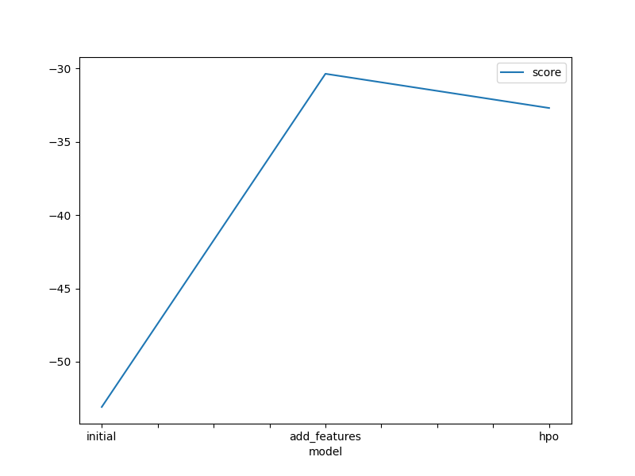
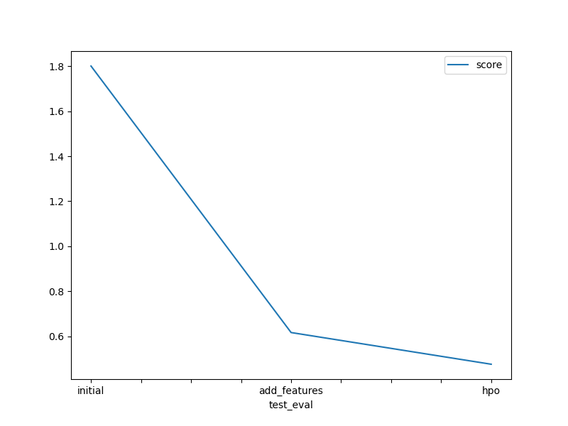

# Report: Predict Bike Sharing Demand with AutoGluon Solution
#### SIMPSON INNOCENT NANA

## Initial Training
### What did you realize when you tried to submit your predictions? What changes were needed to the output of the predictor to submit your results?
Realized missing columns 'casual' and 'registered' prevented submission. Dropped them from the output predictor to enable submission. This allowed generating predictions without these non-essential columns, ensuring successful submission.

### What was the top-ranked model that performed?
The top-ranked model is ```WeightedEnsemble_L3``` with a score value of -53.082868 and 1.80043 in the training and testing phase respectively.


## Exploratory data analysis and feature creation
### What did the exploratory analysis find and how did you add additional features?
Exploratory data analysis revealed data distribution insights. Additional features, like datetime decomposition, were created to enhance model understanding. This included splitting datetime into hour, day, and month parts, providing more granular information for improved model performance.

### How much better did your model perform after adding additional features and why do you think that is?
The model's performance significantly improved after adding additional features, as evidenced by a reduction in the Kaggle score from 1.80043 to 0.61701. These new features provided the model with more relevant information, enabling it to make better predictions and achieve higher accuracy.

## Hyperparameter tuning
### How much better did your model perform after trying different hyperparameters?
After tuning different hyperparameters, the model's performance improved further, with the Kaggle score decreasing from 0.61701 to 0.47626. This reduction indicates that the optimized hyperparameters allowed the model to better capture the underlying patterns in the data, resulting in more accurate predictions.

### If you were given more time with this dataset, where do you think you would spend more time?
Given more time with this dataset, I would focus on feature engineering to extract more meaningful insights from the data. Additionally, I would explore more advanced modeling techniques such as ensemble methods and deep learning architectures to further improve prediction accuracy. These approaches would be particularly beneficial for capturing complex relationships and patterns in the larger dataset, leading to enhanced model performance.

### Create a table with the models you ran, the hyperparameters modified, and the kaggle score.

|model|hpo1|hpo2|hpo3|score|
|--|--|--|--|--|
|initial|default_values|default_values|default_values|1.80043|
|add_features|default_values|default_values|default_values|0.61701|
|hpo|GBM: num_leaves: lower=26, upper=66|XGB: max_depth lower=5, upper=9|refit_full='best'|0.47626|
### Create a line plot showing the top model score for the three (or more) training runs during the project.




### Create a line plot showing the top Kaggle score for the three (or more) prediction submissions during the project.




## Summary
In this project, we significantly improved the predictive performance of our model for bike-sharing demand prediction. Through exploratory data analysis, feature engineering, and hyperparameter tuning, we reduced the root mean squared error (RMSE) from 1.80043 to 0.47626 on the Kaggle test dataset. These improvements demonstrate the effectiveness of our approach in enhancing model accuracy and generalization.
Through this project, I learned the importance of iterative model improvement through exploratory data analysis, feature engineering, and hyperparameter tuning. Each step contributed to enhancing the model's predictive performance, demonstrating the value of a systematic approach to machine learning tasks. Additionally, I gained hands-on experience with AutoGluon, a powerful automated machine-learning framework, and learned how to leverage its capabilities for efficient model building and optimization.


